<!-- GENERATED by worklog roadmap-render. DO NOT EDIT. -->

> This file is generated from `.work/todo.jsonl`. Edits will be overwritten.
> To change the roadmap, change the work items: `worklog add|update|close`.

# Roadmap

_4 epic(s) in flight, 13 open item(s), 0 blocked, 0 unclassified._

## Now

_Nothing here._

## Next

### Agent auto-context injection  ·  P2  ·  0 of 3 done  ·  → v0.5.0
Agents working on a Feature should get the knowledge graph without being asked. When a Feature path or worklog ULID appears in the agent's context, inject a tiny context pack (1 hop, max 8 nodes) so the originating Meeting, Decision and Experiment travel with the work. Gated by pack.auto_inject_on_feature in .pkc/config.yml, which already exists in the config schema but nothing reads yet.

| # | Item | Type | Priority | Status | Blocked by |
|---|---|---|---|---|---|
| [6](https://github.com/SpillwaveSolutions/project-knowledge-capture/issues/6) | Detect Feature path or ULID in agent context | story | P2 | todo | — |
| [7](https://github.com/SpillwaveSolutions/project-knowledge-capture/issues/7) | Inject tiny pack for the detected Feature | story | P2 | todo | — |
| [8](https://github.com/SpillwaveSolutions/project-knowledge-capture/issues/8) | Gate injection behind pack.auto_inject_on_feature | story | P2 | todo | — |

### Incremental materialize  ·  P2  ·  0 of 3 done  ·  → v0.5.0
Re-materializing a large worklog rewrites every concept file even when nothing changed, which churns git diffs and makes the operation O(all work) instead of O(changed work). Fingerprint each worklog item so unchanged ULIDs are skipped before any file is touched. The existing 'skipped' return from write_concept already reports this; the win is not reading and re-rendering the file at all.

| # | Item | Type | Priority | Status | Blocked by |
|---|---|---|---|---|---|
| [9](https://github.com/SpillwaveSolutions/project-knowledge-capture/issues/9) | Fingerprint worklog items on materialize | story | P2 | todo | — |
| [10](https://github.com/SpillwaveSolutions/project-knowledge-capture/issues/10) | Skip unchanged ULIDs without rewriting | story | P2 | todo | — |
| [11](https://github.com/SpillwaveSolutions/project-knowledge-capture/issues/11) | Assert zero-write re-materialize in CI | story | P2 | todo | — |

### Risk and Acceptance concepts  ·  P2  ·  0 of 3 done  ·  → v0.5.0
Two kinds of project knowledge have no home in the graph today: risks (things that might go wrong, and what mitigates them) and acceptance criteria (the atomic conditions that decide whether a Feature is actually done). Both are first-class OKF concepts with their own typed edges, catalogs and templates.

| # | Item | Type | Priority | Status | Blocked by |
|---|---|---|---|---|---|
| [12](https://github.com/SpillwaveSolutions/project-knowledge-capture/issues/12) | Add Risk type with mitigates and exposes edges | story | P2 | todo | — |
| [13](https://github.com/SpillwaveSolutions/project-knowledge-capture/issues/13) | Add Acceptance type with verified_by edge | story | P2 | todo | — |
| [14](https://github.com/SpillwaveSolutions/project-knowledge-capture/issues/14) | Cover Risk and Acceptance in sample-knowledge | story | P2 | todo | — |

### MCP server mode  ·  P2  ·  0 of 3 done  ·  → v0.5.0
PKC's capabilities are reachable only from Claude Code and Grok Build because they are packaged as skills. Exposing pack, validate and capture over MCP makes the same knowledge graph available to any MCP host without duplicating the logic.

| # | Item | Type | Priority | Status | Blocked by |
|---|---|---|---|---|---|
| [15](https://github.com/SpillwaveSolutions/project-knowledge-capture/issues/15) | Expose pack over MCP | story | P2 | todo | — |
| [16](https://github.com/SpillwaveSolutions/project-knowledge-capture/issues/16) | Expose validate over MCP | story | P2 | todo | — |
| [17](https://github.com/SpillwaveSolutions/project-knowledge-capture/issues/17) | Expose capture over MCP | story | P2 | todo | — |

### (no epic)

| # | Item | Type | Priority | Status | Blocked by |
|---|---|---|---|---|---|
| [18](https://github.com/SpillwaveSolutions/project-knowledge-capture/issues/18) | Resolve worklog IA gate warnings before they harden | task | P2 | todo | — |

## Later

_Nothing here._

## Milestones

### v0.5.0

| # | Item | Type | Priority | Status | Blocked by |
|---|---|---|---|---|---|
| [6](https://github.com/SpillwaveSolutions/project-knowledge-capture/issues/6) | Detect Feature path or ULID in agent context | story | P2 | todo | — |
| [7](https://github.com/SpillwaveSolutions/project-knowledge-capture/issues/7) | Inject tiny pack for the detected Feature | story | P2 | todo | — |
| [8](https://github.com/SpillwaveSolutions/project-knowledge-capture/issues/8) | Gate injection behind pack.auto_inject_on_feature | story | P2 | todo | — |
| [9](https://github.com/SpillwaveSolutions/project-knowledge-capture/issues/9) | Fingerprint worklog items on materialize | story | P2 | todo | — |
| [10](https://github.com/SpillwaveSolutions/project-knowledge-capture/issues/10) | Skip unchanged ULIDs without rewriting | story | P2 | todo | — |
| [11](https://github.com/SpillwaveSolutions/project-knowledge-capture/issues/11) | Assert zero-write re-materialize in CI | story | P2 | todo | — |
| [12](https://github.com/SpillwaveSolutions/project-knowledge-capture/issues/12) | Add Risk type with mitigates and exposes edges | story | P2 | todo | — |
| [13](https://github.com/SpillwaveSolutions/project-knowledge-capture/issues/13) | Add Acceptance type with verified_by edge | story | P2 | todo | — |
| [14](https://github.com/SpillwaveSolutions/project-knowledge-capture/issues/14) | Cover Risk and Acceptance in sample-knowledge | story | P2 | todo | — |
| [15](https://github.com/SpillwaveSolutions/project-knowledge-capture/issues/15) | Expose pack over MCP | story | P2 | todo | — |
| [16](https://github.com/SpillwaveSolutions/project-knowledge-capture/issues/16) | Expose validate over MCP | story | P2 | todo | — |
| [17](https://github.com/SpillwaveSolutions/project-knowledge-capture/issues/17) | Expose capture over MCP | story | P2 | todo | — |

## Visual roadmap

### Dependency graph

```mermaid
graph TD
    01KZ75NC58VJD8E219BYAYPBPA["📦 Agent auto-context injection"]
    01KZ75NQ2VDVFD3R9F0SV38YEN["📦 Incremental materialize"]
    01KZ75NQ7VFPF3YESB5P90DR29["📦 Risk and Acceptance concepts"]
    01KZ75NQCMYGFYRCVJATEBVBRB["📦 MCP server mode"]
    01KZ75R1ZYFEZVPWDY73CK4P4N["📦 Detect Feature path or ULID in"]
    01KZ75R254CS97W8MNX9CV3SNF["📦 Inject tiny pack for the detec"]
    01KZ75R2ADREHM3JD22V5C5HE7["📦 Gate injection behind pack.aut"]
    01KZ75R2FPH92VY79KNR6MP59E["📦 Fingerprint worklog items on m"]
    01KZ75R2NDYVCGERRTKE9XCRM2["📦 Skip unchanged ULIDs without r"]
    01KZ75R2TEF13SKZYZ3DSBS5BZ["📦 Assert zero-write re-materiali"]
    01KZ75R2ZJGMNBHD82WZXPCNX4["📦 Add Risk type with mitigates a"]
    01KZ75R34PGN7WH6HCP44B85A2["📦 Add Acceptance type with verif"]
    01KZ75R39PENN65G92HKA108H3["📦 Cover Risk and Acceptance in s"]
    01KZ75R3EXEG4GVGRP2S9CCKZ4["📦 Expose pack over MCP"]
    01KZ75R3M6BYQ643NKDCCSEEZC["📦 Expose validate over MCP"]
    01KZ75R3S2X1G4PCTGMMSR8BWA["📦 Expose capture over MCP"]
    01KZ75VWSERRKEZE957R1MBE9B["🔧 Resolve worklog IA gate warnin"]
    01KZ75NC58VJD8E219BYAYPBPA --> 01KZ75R1ZYFEZVPWDY73CK4P4N
    01KZ75NC58VJD8E219BYAYPBPA --> 01KZ75R254CS97W8MNX9CV3SNF
    01KZ75NC58VJD8E219BYAYPBPA --> 01KZ75R2ADREHM3JD22V5C5HE7
    01KZ75NQ2VDVFD3R9F0SV38YEN --> 01KZ75R2FPH92VY79KNR6MP59E
    01KZ75NQ2VDVFD3R9F0SV38YEN --> 01KZ75R2NDYVCGERRTKE9XCRM2
    01KZ75NQ2VDVFD3R9F0SV38YEN --> 01KZ75R2TEF13SKZYZ3DSBS5BZ
    01KZ75NQ7VFPF3YESB5P90DR29 --> 01KZ75R2ZJGMNBHD82WZXPCNX4
    01KZ75NQ7VFPF3YESB5P90DR29 --> 01KZ75R34PGN7WH6HCP44B85A2
    01KZ75NQ7VFPF3YESB5P90DR29 --> 01KZ75R39PENN65G92HKA108H3
    01KZ75NQCMYGFYRCVJATEBVBRB --> 01KZ75R3EXEG4GVGRP2S9CCKZ4
    01KZ75NQCMYGFYRCVJATEBVBRB --> 01KZ75R3M6BYQ643NKDCCSEEZC
    01KZ75NQCMYGFYRCVJATEBVBRB --> 01KZ75R3S2X1G4PCTGMMSR8BWA
    classDef todo fill:#f4f4f4,stroke:#999999
    class 01KZ75NC58VJD8E219BYAYPBPA,01KZ75NQ2VDVFD3R9F0SV38YEN,01KZ75NQ7VFPF3YESB5P90DR29,01KZ75NQCMYGFYRCVJATEBVBRB,01KZ75R1ZYFEZVPWDY73CK4P4N,01KZ75R254CS97W8MNX9CV3SNF,01KZ75R2ADREHM3JD22V5C5HE7,01KZ75R2FPH92VY79KNR6MP59E,01KZ75R2NDYVCGERRTKE9XCRM2,01KZ75R2TEF13SKZYZ3DSBS5BZ,01KZ75R2ZJGMNBHD82WZXPCNX4,01KZ75R34PGN7WH6HCP44B85A2,01KZ75R39PENN65G92HKA108H3,01KZ75R3EXEG4GVGRP2S9CCKZ4,01KZ75R3M6BYQ643NKDCCSEEZC,01KZ75R3S2X1G4PCTGMMSR8BWA,01KZ75VWSERRKEZE957R1MBE9B todo
```

### Hierarchy

```mermaid
graph TD
    01KZ75NC58VJD8E219BYAYPBPA["📦 Agent auto-context injection"]
    01KZ75NQ2VDVFD3R9F0SV38YEN["📦 Incremental materialize"]
    01KZ75NQ7VFPF3YESB5P90DR29["📦 Risk and Acceptance concepts"]
    01KZ75NQCMYGFYRCVJATEBVBRB["📦 MCP server mode"]
    01KZ75R1ZYFEZVPWDY73CK4P4N["📦 Detect Feature path or ULID in"]
    01KZ75R254CS97W8MNX9CV3SNF["📦 Inject tiny pack for the detec"]
    01KZ75R2ADREHM3JD22V5C5HE7["📦 Gate injection behind pack.aut"]
    01KZ75R2FPH92VY79KNR6MP59E["📦 Fingerprint worklog items on m"]
    01KZ75R2NDYVCGERRTKE9XCRM2["📦 Skip unchanged ULIDs without r"]
    01KZ75R2TEF13SKZYZ3DSBS5BZ["📦 Assert zero-write re-materiali"]
    01KZ75R2ZJGMNBHD82WZXPCNX4["📦 Add Risk type with mitigates a"]
    01KZ75R34PGN7WH6HCP44B85A2["📦 Add Acceptance type with verif"]
    01KZ75R39PENN65G92HKA108H3["📦 Cover Risk and Acceptance in s"]
    01KZ75R3EXEG4GVGRP2S9CCKZ4["📦 Expose pack over MCP"]
    01KZ75R3M6BYQ643NKDCCSEEZC["📦 Expose validate over MCP"]
    01KZ75R3S2X1G4PCTGMMSR8BWA["📦 Expose capture over MCP"]
    01KZ75VWSERRKEZE957R1MBE9B["🔧 Resolve worklog IA gate warnin"]
    01KZ75NC58VJD8E219BYAYPBPA --> 01KZ75R1ZYFEZVPWDY73CK4P4N
    01KZ75NC58VJD8E219BYAYPBPA --> 01KZ75R254CS97W8MNX9CV3SNF
    01KZ75NC58VJD8E219BYAYPBPA --> 01KZ75R2ADREHM3JD22V5C5HE7
    01KZ75NQ2VDVFD3R9F0SV38YEN --> 01KZ75R2FPH92VY79KNR6MP59E
    01KZ75NQ2VDVFD3R9F0SV38YEN --> 01KZ75R2NDYVCGERRTKE9XCRM2
    01KZ75NQ2VDVFD3R9F0SV38YEN --> 01KZ75R2TEF13SKZYZ3DSBS5BZ
    01KZ75NQ7VFPF3YESB5P90DR29 --> 01KZ75R2ZJGMNBHD82WZXPCNX4
    01KZ75NQ7VFPF3YESB5P90DR29 --> 01KZ75R34PGN7WH6HCP44B85A2
    01KZ75NQ7VFPF3YESB5P90DR29 --> 01KZ75R39PENN65G92HKA108H3
    01KZ75NQCMYGFYRCVJATEBVBRB --> 01KZ75R3EXEG4GVGRP2S9CCKZ4
    01KZ75NQCMYGFYRCVJATEBVBRB --> 01KZ75R3M6BYQ643NKDCCSEEZC
    01KZ75NQCMYGFYRCVJATEBVBRB --> 01KZ75R3S2X1G4PCTGMMSR8BWA
```

