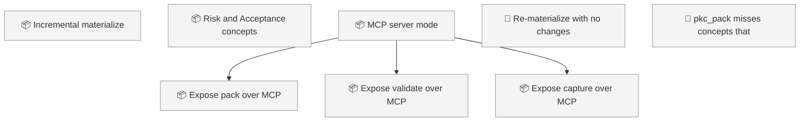
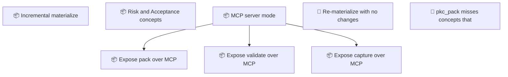

<!-- GENERATED by worklog roadmap-render. DO NOT EDIT. -->

> This file is generated from `.work/todo.jsonl`. Edits will be overwritten.
> To change the roadmap, change the work items: `worklog add|update|close`.

# Roadmap

_1 epic(s) in flight, 5 open item(s), 0 blocked, 0 unclassified._

## Now

_Nothing here._

## Next

### MCP server mode  ·  P2  ·  0 of 3 done  ·  → v0.6.0
PKC's capabilities are reachable only from Claude Code and Grok Build because they are packaged as skills. Exposing pack, validate and capture over MCP makes the same knowledge graph available to any MCP host without duplicating the logic.

| # | Item | Type | Priority | Status | Blocked by |
|---|---|---|---|---|---|
| [15](https://github.com/SpillwaveSolutions/project-knowledge-capture/issues/15) | Expose pack over MCP | story | P2 | todo | — |
| [16](https://github.com/SpillwaveSolutions/project-knowledge-capture/issues/16) | Expose validate over MCP | story | P2 | todo | — |
| [17](https://github.com/SpillwaveSolutions/project-knowledge-capture/issues/17) | Expose capture over MCP | story | P2 | todo | — |

### (no epic)

| # | Item | Type | Priority | Status | Blocked by |
|---|---|---|---|---|---|
| 01KZD15Z | Re-materialize with no changes still churns catalogs and log | task | P2 | todo | — |
| 01KZD6QR | pkc_pack misses concepts that point at the seed | task | P2 | todo | — |

## Later

_Nothing here._

## Milestones

### v0.6.0

| # | Item | Type | Priority | Status | Blocked by |
|---|---|---|---|---|---|
| [15](https://github.com/SpillwaveSolutions/project-knowledge-capture/issues/15) | Expose pack over MCP | story | P2 | todo | — |
| [16](https://github.com/SpillwaveSolutions/project-knowledge-capture/issues/16) | Expose validate over MCP | story | P2 | todo | — |
| [17](https://github.com/SpillwaveSolutions/project-knowledge-capture/issues/17) | Expose capture over MCP | story | P2 | todo | — |

## Visual roadmap

### Dependency graph

### Hierarchy

