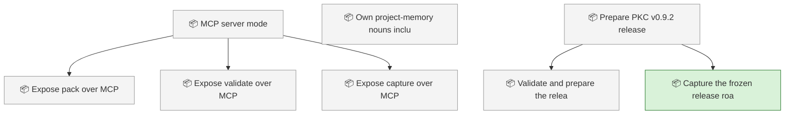
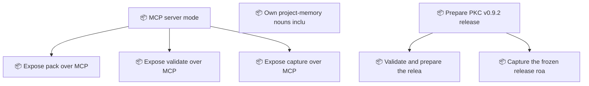

<!-- GENERATED by worklog roadmap-render. DO NOT EDIT. -->

> This file is generated from `.work/todo.jsonl`. Edits will be overwritten.
> To change the roadmap, change the work items: `worklog add|update|close`.

# Roadmap

_2 epic(s) in flight, 6 open item(s), 0 blocked, 0 unclassified._

## Now

### Prepare PKC v0.9.2 release  ·  P1  ·  1 of 3 done
Prepare and verify the patch release that makes materialization dry-runs side-effect-free.

| # | Item | Type | Priority | Status | Blocked by |
|---|---|---|---|---|---|
| 01M1CGCY | Capture the frozen release roadmap and refresh wiki IA | task | P2 | in progress | — |

## Next

### MCP server mode  ·  P2  ·  0 of 3 done  ·  → v0.8.0
PKC's capabilities are reachable only from Claude Code and Grok Build because they are packaged as skills. Exposing pack, validate and capture over MCP makes the same knowledge graph available to any MCP host without duplicating the logic.

| # | Item | Type | Priority | Status | Blocked by |
|---|---|---|---|---|---|
| [15](https://github.com/SpillwaveSolutions/project-knowledge-capture/issues/15) | Expose pack over MCP | story | P2 | todo | — |
| [16](https://github.com/SpillwaveSolutions/project-knowledge-capture/issues/16) | Expose validate over MCP | story | P2 | todo | — |
| [17](https://github.com/SpillwaveSolutions/project-knowledge-capture/issues/17) | Expose capture over MCP | story | P2 | todo | — |

### Prepare PKC v0.9.2 release  ·  P1  ·  1 of 3 done
Prepare and verify the patch release that makes materialization dry-runs side-effect-free.

| # | Item | Type | Priority | Status | Blocked by |
|---|---|---|---|---|---|
| 01M1CGCY | Validate and prepare the release pull request | task | P2 | todo | — |

### (no epic)

| # | Item | Type | Priority | Status | Blocked by |
|---|---|---|---|---|---|
| 01M0SZFF | Own project-memory nouns including TicketLink and work types | story | P1 | todo | — |

## Later

_Nothing here._

## Milestones

### v0.8.0

| # | Item | Type | Priority | Status | Blocked by |
|---|---|---|---|---|---|
| 01M0SZFF | Own project-memory nouns including TicketLink and work types | story | P1 | todo | — |
| [15](https://github.com/SpillwaveSolutions/project-knowledge-capture/issues/15) | Expose pack over MCP | story | P2 | todo | — |
| [16](https://github.com/SpillwaveSolutions/project-knowledge-capture/issues/16) | Expose validate over MCP | story | P2 | todo | — |
| [17](https://github.com/SpillwaveSolutions/project-knowledge-capture/issues/17) | Expose capture over MCP | story | P2 | todo | — |

## Visual roadmap

### Dependency graph

### Hierarchy

