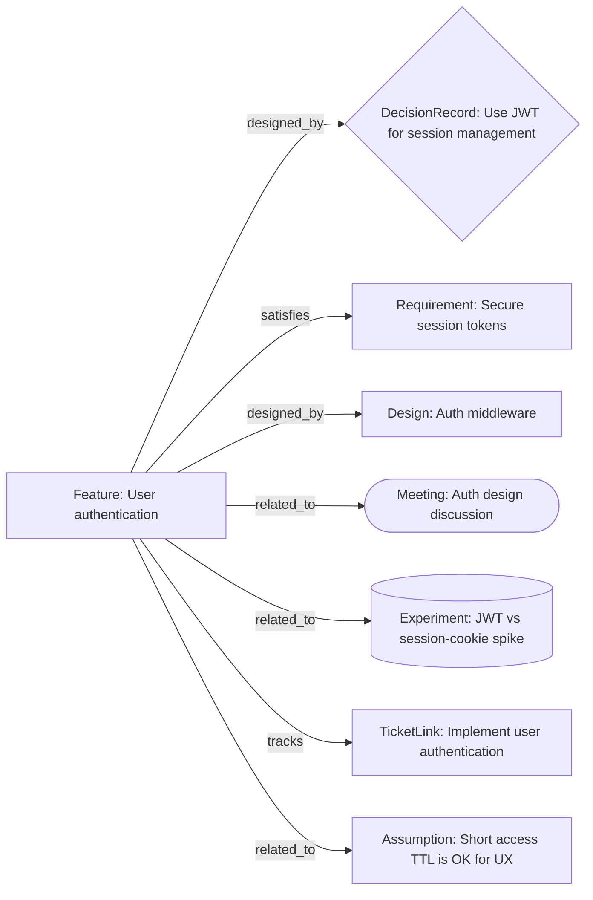

# Context pack: `/features/user-authentication.md`

- Hops: **1**
- Nodes: **8** (max 8)
- Generated: 2026-08-04T04:29:31Z

## Graph

## Nodes (ranked)

### [User authentication](/features/user-authentication.md) · `Feature` · depth 0

Sign-in, session, and refresh for end users

> Shaped by [Use JWT for session management](/decisions/use-jwt-for-session.md). - Assumption: [Short access TTL is OK for UX](/assumptions/short-ttl-ok-for-ux.md) - Open question: [Need distributed revoke denylist in v1?](/questions/need-revoke-denylist-v1.md)

### [Use JWT for session management](/decisions/use-jwt-for-session.md) · `DecisionRecord` · depth 1

Adopt short-lived JWT access tokens with httpOnly refresh cookies

> Use short-lived JWT access tokens + httpOnly refresh cookies.

### [Auth design discussion](/meetings/2026-08-03-auth-design.md) · `Meeting` · depth 1

Decided on JWT session approach for horizontal scaling

> - Date: 2026-08-03 - Attendees: rick, alice - Duration: 45 minutes 1. Review session strategies for multi-instance deploy 2. Compare JWT vs sticky session cookies 3. Agree on refresh/revoke approach We need auth that survives horizontal scale-out without shared session stores. Alice walked through the cookie-session prototype; Rick shared JWT spike results from [JWT vs session-cookie spike](/exper…

### [JWT vs session-cookie spike](/experiments/jwt-vs-cookie.md) · `Experiment` · depth 1

Both workable; JWT chosen for statelessness

> Proceed with JWT.

### [Short access TTL is OK for UX](/assumptions/short-ttl-ok-for-ux.md) · `Assumption` · depth 1

15-minute JWT access tokens will not harm user experience

> 15-minute JWT access tokens will not harm user experience if silent refresh works. Peers use similar TTLs; refresh cookies hide rotation from users. Instrument refresh failure rate in production for 2 weeks.

### [Auth middleware](/designs/auth-middleware.md) · `Design` · depth 1

Request middleware that validates JWT and attaches principal

> Validates Bearer JWT and attaches principal.

### [Secure session tokens](/requirements/secure-session-tokens.md) · `Requirement` · depth 1

Access tokens must be short-lived; refresh tokens httpOnly

> Access tokens MUST expire within 15 minutes.

### [Implement user authentication](/tickets/ticket-01kexample0000000000000001.md) · `TicketLink` · depth 1

WikiTicket bridge for the user-authentication feature

> Worklog ULID `01KEXAMPLE0000000000000001`.

## Edges

- `/features/user-authentication.md` —[designed_by]→ `/decisions/use-jwt-for-session.md`
- `/features/user-authentication.md` —[satisfies]→ `/requirements/secure-session-tokens.md`
- `/features/user-authentication.md` —[designed_by]→ `/designs/auth-middleware.md`
- `/features/user-authentication.md` —[related_to]→ `/meetings/2026-08-03-auth-design.md`
- `/features/user-authentication.md` —[related_to]→ `/experiments/jwt-vs-cookie.md`
- `/features/user-authentication.md` —[tracks]→ `/tickets/ticket-01kexample0000000000000001.md`
- `/features/user-authentication.md` —[related_to]→ `/assumptions/short-ttl-ok-for-ux.md`
- `/features/user-authentication.md` —[related_to]→ `/questions/need-revoke-denylist-v1.md`

_Nodes beyond hops/max_nodes omitted for progressive disclosure._
